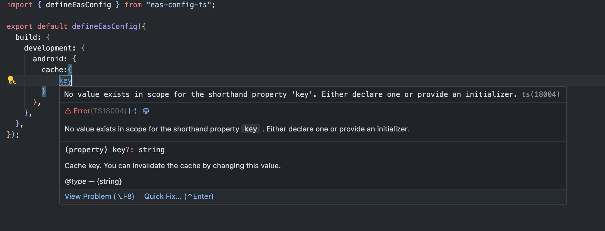

# eas-config-ts

A TypeScript-based configuration generator for EAS (Expo Application Services).



## Installation

```bash
pnpm add -D eas-config-ts
```

## Usage

1. Create an `eas.config.ts` file in your project root with your EAS configuration.

```typescript
import { defineEasConfig } from "eas-config-ts";
// necessary if you want to use dotenv
import "dotenv/config";

export default defineEasConfig({
  // your config
  build: {
    development: {
      env: process.env,
    },
  },
});
```

2. Run the following command to generate `eas.json`

```bash
npx gen-eas-config
```
